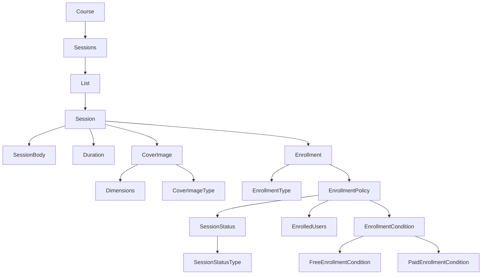

# 학습 관리 시스템(Learning Management System)
## 진행 방법
* 학습 관리 시스템의 수강신청 요구사항을 파악한다.
* 요구사항에 대한 구현을 완료한 후 자신의 github 아이디에 해당하는 브랜치에 Pull Request(이하 PR)를 통해 코드 리뷰 요청을 한다.
* 코드 리뷰 피드백에 대한 개선 작업을 하고 다시 PUSH한다.
* 모든 피드백을 완료하면 다음 단계를 도전하고 앞의 과정을 반복한다.

## 온라인 코드 리뷰 과정
* [텍스트와 이미지로 살펴보는 온라인 코드 리뷰 과정](https://github.com/next-step/nextstep-docs/tree/master/codereview)

# 1단계 : 레거시 코드 리팩터링
## 리팩터링 요구사항
- nextstep.qna.service.QnaService의 `deleteQuestion()`는 앞의 질문 삭제 기능을 구현한 코드이다. 
  - 이 메소드는 단위 테스트하기 어려운 코드와 단위 테스트 가능한 코드가 섞여 있다.
- QnaService의 `deleteQuestion()` 메서드에 단위 테스트 가능한 코드(핵심 비지니스 로직)를 도메인 모델 객체에 구현한다.
- QnaService의 비지니스 로직을 도메인 모델로 이동하는 리팩터링을 진행할 때 TDD로 구현한다.
- QnaService의 `deleteQuestion()` 메서드에 대한 단위 테스트는 src/test/java 폴더 `nextstep.qna.service.QnaServiceTest`이다. 
  - 도메인 모델로 로직을 이동한 후에도 QnaServiceTest의 모든 테스트는 통과해야 한다.

## 리팩터링 절차
1. 테스트하기 쉬운 부분(비즈니스 로직)과 어려운 부분(날짜, 셔플, 랜덤, DB, API call)을 구분해보기
2. 분리 시 먼저 단위테스트 추가
3. 관련 비즈니스 로직을 도메인 객체로 이동

## 리팩터링 계획
1. `List<Answer>` 의 일급컬렉션으로 래핑 및 주요 로직 이동
   - [x] : 이동 및 테스트 완료
2. `List<DeleteHistory>` 의 일급컬렉션으로 래핑 및 주요 로직 이동
    - [x] : 이동 및 테스트 완료
3. `Question` 의 주요 로직 이동
    - [x] : 이동 및 테스트 완료
4. 불필요한 setter 제거
5. 인스턴스 변수 수 줄이기

## 1차 피드백

- [x] : 분리된 글쓴이 판단 -> 삭제 상태로 변경 한번에
    - [x] : 이 방식이 좋은 이유?
        - 반대의견 : `deleteQuestion()` 은 삭제가 행동이지만, 삭제의 큰 흐름은 알아야한다
            - 권한이 있는지, 연관 `Answers` 까지 아는지? 그리고 너무 과하게 코드를 줄인다.
        - 찬성의견 : 해당 도메인 내부에 있는 값을 굳이 노출시키거나 꺼내서 해결할 필요는 없다
            - `deleteQuestion()`의 관심사는 말 그대로 질문 삭제일 뿐이다
                - 얘는 삭제 권한이있는지, 답변이 모드 같은 사람이 쓴건지 이런것은 관심이 없다.
                - 그냥 삭제만 하고 싶어할 뿐이다.
    - 정리한 찬성 의견
        1. 도메인 불변식 유지 : 모델이 깨지면 안되는 규칙 -> 어떤 경로이든 참이어야 함
            - 규칙검증을 서비스에 두면 제3의 다른서비스는 이 규칙 검증을 건너뛸 수있게 됨
            - 규칙이 도메인 밖으로 새면 안됨
        2. 서비스 레이어 메서드는 외부(DB, I/O, 셔플)와 `@Transactional` 가 관심사임
            - 비즈니스 규칙 자체는 도메인 내부에서 해결해야함
- [x] : 연관된 답변까지 Question 에서 한꺼번에 삭제
- [x] : 불필요하게 분리된 객체의 필요성 고민
    - 고민 결과 도메인만의 규칙, 행동이 없으므로 롤백

## 2차 피드백

- [x] : 불필요한 setter 와 getter의 무의미한 재귀 호출 제거 (재귀호출 stack over flow 위험)
- [x] : 삭제 시 삭제됐는지 확인하는 메서드 필요한지? 필요없다면 이유 작성
    - 이유
        - this.isQuestionDeleteDone(); 같은 도메인 내부에서 값의 변화를 검증하는 부분인데,
            1. 도메인 내부 값 변화는 확실한 점
            2. 그래서 도메인 내부에서 값 변화를 체크하는 방어코드는 무의미한 점
            3. 만약 검증하려면 db(영속성) 레이어 혹은 트랜잭셔널 범위(서비스 레이어) 등에서 검증해야하지만 금번 과제는 리팩터링 이므로 추가 할 필요가 없는점
        - 이므로 제거
- [x] : `Answer` 에 대한 삭제 테스트 필요하자않은가? 이유작성
    - 이유 : 필요하다 Answer 을 수동적으로 바라보았기에 비즈니스 로직에 대한 테스트 코드가 생략되었다.
- [ ] : `Answers` 에서 한땀한땀 삭제하는건 `Answer` 에 대한 수동적으로 바라보는 느낌아닌가? 이유 작성
    - 이유 : 맞다 또한 검증에 대해서도 모두 수행하는것은 바람직하지 않음, 검증은 `Answer` 내부에서 해야함

## 3차 피드백
- [x] : `Question` 의 `title`, `contents` 필드를 별도로 `QuestionBody` 로 분리하는 것이 의미 있을까?
    - 생각컨데 분리는 의마가 없다고 본다.
        - 그 이유는 : `title`, `contents` 로 분리를 하면은 값을 보관해주는 역할에 불과한 점
        - 분리한 객체만의 특별한 도메인 규칙이나 행동이 없는 점
    - 때문이다.

# 2단계 : 수강신청(도메인 모델)

- DB 테이블 설계 없이 도메인 모델부터 구현하기
    - 도메인 모델은 TDD로 구현 (Service 클래스는 단위 테스트 없이)

## 기능목록

1. 과정(Course)과 강의(Session)
    - 과정(Course)은 '기수' 단위 운영
    - 과정에 여러개의 강의(Session) 를 가질 수있음
2. 강의 기간
    - 시작일과 종료일 가짐
3. 강의에 커버이미지 가짐
    - 이미지 크기는 1MB 이하
    - 이미지 타입은 gif, jpg(jpeg), png, svg
    - 이미지 크기 : width - 300px / height - 200px 이상
        - width / height 비율 3:2
4. 강의 타입 : '무료 강의' '유료 강의'로 나누어진다
    - 무료 강의 : 최대 수강신청 인원 제한이 없다
    - 유료 강의 : 강의 최대 수강 인원 초과할 수 없음
        - 수강생이 결제한 금액과 수강료가 일치 할 시 수강 신청 가능
5. 강의 상태 : '준비중', '모집중', '종료'
    - 모집 중 일때 강의 수강신청 가능
6. 결제
    - 유료 강의 결제는 이미 완료된 것으로 가정 하고 이후 과정 구현함
    - 결제 완료 한 결제정보는 payments 모듈로 관리, 결제정보는 Payment 객체에 담겨 반환

## 객체 설계

### 객체 역할

- Course : 기수별 session 들의 관리관련 정보 전문가 및 행위 책임자
- Session : 강의 자체의 전반적인 정보 전문가 및 행위 책임자
- Duration : 강의의 시작, 종료 관련 정보 전문가 및 행위 책임자
- CoverImage : 강의의 커버 이미지 관련 정보 전문가 및 행위 책임자
    - CoverImageType
- ProvideType : 강의의 무료, 유료 강의 관련 정보 전문가 및 행위 책임자
- SessionStatus : 강의의 준비중, 모집 중 같은 정보 전문가 및 행위 책임자
    - SessionStatusType

### 구현 순서 (작은 도메인 부터)

Duration → CoverImage → SessionStatus → ProvideType → Session → Course

### 중요 : 만들어진 강의에 수강신청 하는 것임

### 객체 별 기능 사항

#### Duration

- [x] : 종료일이 시작일 보다 뒤에 있을 수없다
- [x] : 시작일과 종료일이 오늘보다 뒤에 있다
- [ ] : startDate, endDate 원시 값 포장

#### CoverImage

- [x] : 커버 이미지의 크기는 1MB 이하이다
- [x] : 이미지 타입은 gif, jpg(jpeg), png, svg 이다 (CoverImageType)
- [x] : 이미지 크기는 width - 300px / height - 200px 이상 이다
- [x] : width / height 비율 3:2 이다

#### SessionStatus

- [x] : 모집 중 일때 만 강의 수강신청 가능

#### Provide

- [x] : 강의 타입은 무료 강의, 유료 강의 2가지 이다.
    - [x] : 수강신청 제한인원은 타입에 존재한다 (규칙)
- [x] : 강의를 수강신청 하면 수강생 수가 올라간다
    - [x] : 클라이언트 코드에서 수강신청 제한인원 받아서 그 수가 넘는지 확인해준다
- [x] : 지불금액을 보고 금액이 같은지 검증한다
    - [x] : 무료인데 지불하면 안된다.

##### 객체 분리 필요성 고민

1. Provide 를 Free, Paid 로 객체를 나눌 것인가?
    - 기대효과 : 각각 다른 규칙에 대해서 정리 가능
        - 예) 무료 : 인원수 제한 X/ 금액 무료
    - 한계점 : 비슷한 형태의 객체가 2개인데, 어떤 강의를 신청하느냐에 따라 요청이 오거나, 불러오는 객체가 달라짐

2. enrolledCount, maxEnrollment / tuitionFee, pay 각각 묶을 것인가?
    - 기대효과 : 인원수 체크가 손쉽게 됨, 금액을 내야하는지 체크가 가능 / 서로 비슷한 규칙끼리 묶여서 검증 쉬움
    - 한계점 : 최초 고민인 무료인 경우 인원수 제한, 수강료에 대한 통제는 여전히 어려움
        - 규칙 : 그러나 만들어진 각각 객체안에서 무료인 경우 제한 검증 X, 수강료 검증 X 되지 않을까?
        - 생성 : 무료인경우 생성자 인자를 생략하기? -> but 결국에 인원수를 0으로 세팅해야함

3. enrolledCount, tuitionFee / pay, maxEnrollment 각각 묶을 것인가?
    - 기대 효과 : 무료, 유료인 경우에 대한 변칙 적용이 수월함
    - 한계점 : 묶이는 필드끼리 생명주기가 같을지 의문
        - 차라리 현상이 아닌 정해진 생명주기끼리 묶는게 낫지않을까?
            - 예) tuitionFee, maxEnrollment (세션자체의 규칙) / enrolledCount, pay (요청 때 마다 변칙)
                - 전자는 Session 에서, 후자는 Provide 에서

4. tuitionFee, maxEnrollment / pay, enrolledCount 각각 묶을 것인가?
    - 기대 효과 : tuitionFee, maxEnrollment 는 상위 클래스 Session 에서 통제함
        - 제약과 현상을 분리함
        - 무료인 경우 0 fee 와 무제한 수강인원에 대한 검증 가능
        - 그리고 억지로 0으로 만들필요 없음
    - 한계점 : 하지만 전자를 결국에 객체로 만들면 0으로 세팅이 필요함
        - 결국에 상단 2번처럼 문제가

- 고민
    - 정원을 숫자가 아닌 정책으로 보아야함
        - 무제한 정책은 숫자가 필요없음
        - 제한 정책은 숫자가 필요
    - 정원이 없는것은 null 로 지정 가능
        - DDD 관점에서 '개념 부재' 표현임 (null 보다 의미없는 값(0) 으로 도메인 개념 왜곡이 더큰 문제)
        - null 은 인간언어로 표현 가능함
    - 두갈래 고민
        - 2번 : 수강생 수 / 비용 으로 분리
            - 생성 방식에 대한 문제 해결함 -> 고려 가능
            - 도달 여부 쉽게 판단
        - 4번 : 기준 / 준수여부 로 분리
            - 생명주기 비슷
- 최종 결정
    - 4번: ProvidePolicy / ProvideStatus
        - 걱정 : null 로 넣는게 인위적인데 전략패턴을 이용해야할까 싶으면서 오버엔지이너링일까 우려됨

#### Session

- [x] : `Provide` 에게 해당 세션의 제한인원 수 전달해서 남은 자리 조율
- [x] : 무료, 유료에 따라서 수강신청 메서드 분리

#### Course

- [x] : 신청하는 강의의 id 와 가격을 넣어서 수강신청한다
- [x] : 수강신청 하려는 session의 id가 없으면 예외전파

#### CourseService

- [x] : 해당 코스의 특정 강의를 조회한다
- [x] : 조회한 강의를 수강신청한다
    - 무료강의 이면 바로 신청
    - 유료 강의 이면 결제 모듈 조회 후 신청
        - 당연 성공이므로 곧바로 amount 넣기
- [x] : 조회 성공 후 결과를 저장하기

#### 놓치거나 마무리 부분

- [x] : 수강신청한 수강생의 정보 넣기
- [x] : 결제 완료를 기준으로 던지기
- [x] : 컬렉션을 일급 컬렉션으로 바꾸기 (EnrolledUsers, Sessions)

## 1차 피드백

- [x] : 무료 유료인 상태의 객체 구분을 null로 구현이 아닌, null을 추상화한 Null Object 로 추가
    - 인터페이스로 null Object 로 구분하기 / 그에 따라서 구현하는 방향 바꾸기
        - 무료는 싱글턴 null 객체로, 유료는 생성자로 초기화
        - DI 방식으로 하니 무분별하게 분기 칠 필요가 없어짐
- [x] : 무료 유료 구분은 생성자 유무가 아닌 ProvideType 값에 따라 결정
    - apply() 분기도 마찬가지
- [x] : Base 추상클래스로 구현하여 직접 생상안되게 하기
- [x] : CoverImage 필드 수 줄이기
- [x] : boolean 타입이 아닌데 is 로 시작하는 메서드명 validate 시작으로 변경
- [x] : `ProvidePolicy` 에 수강신청 판단 하는 모든 값 가져도 될지 고민하기
    - SessionStatus, 현재 수강신청한 수강생 목록도 신청여부 판단에 필요한 값
    - -> 이름을 Enrollment의 EnrollmentPolicy로 몀명하니 필요성을 가지게 됨
- [x] : 복잡한 객체의 테스트 데이터 생성 시 중복코드 많고, 생성자 인자가 변경되는 경우 변경할 부분이 많음
    - 테스트 데이터 생성 시 방법 탐색해서 적용 후 앞으로 활용하기
    - 테스트 픽스쳐를 '오브젝트 마더 패턴' + 빌더패턴'(기본 값 숨기기, 빌더 덜쓰기, 팩토리 메서드를 이용해 도메인 강조, 비슷한 객체를 이용 시 코드 줄이기위한 but 사용)
        - 이용해서 축소

# 3단계 : 수강신청(DB 적용)

## 기존 Object Graph

## 영상에서 DB 만들기

- 목적 : 빠른 지식축적 -> 도메인에 최적화된 설계 -> 요구사항에 변화 대응

### 객체와 DB 고려

- 인터페이스로 Repository 만들어서 특정 조건일 때 인터페이스로 CRUD 하기
- 자바 오브젝트가 DB에 의존해서 setter, getter 되는경우는 안됨
    - 빈도(tag수) 의 ++, -- 를 DB 로 하는게 아닌 객체의 변화로 이용

### 객체와 테이블 매핑

1. 이제 @Entity 를 이용해서 구현
    - 이 시점에 성능을 고려함
        - 관계형 VS 객체지향형간의 관계!!!
2. 이후 하이버네이트의 create 옵션으로 테이블 자동생성하게 함

- 개발 시 자기 만족할 수준까지 비즈니스 로직, 설계하면 스키마나 속성이 바뀌어도 테이블이 자동으로 만들어서 이용
- 스키마 만들고 한 관리 할 필요없음 ,피드백을 빨리 주고 받으면서 가능해짐

3. 안정화 되면 이제 이용
    - DB 마이그레이션으로 도구로 스키마 관리
    - db/migration 디렉토리에 schema_version 테이블이 있음

### 실제 절차

@Entity 구현 -> 하이버네이트로 create 테이블 생성 -> 변경되면 db/migration 에 넣기

## 프로그래밍 요구사항

- 앞단계 구현한 도메인 모델을 DB 테이블과 매핑하고 데이터 저장
    - 테이블 설계와 객체 매핑에 초점둘 것 / CRUD 쿼리, 코드 구현은 차치
    - Payment 테이블 매핑은 고려 안해도 됨

## 애그리거트 경계 나누기

- Course : 하나의 기수 관리하는 테이블
- Session : 하나의 강의 관리하는 테이블
    - SessionBody : 제목, 내용
    - Duration : 강의 기간
    - CoverImage : 섬네일 이미지
- Enrollment : 해당 강의 수강 신청을 관리하는 테이블
    - EnrollmentUsers : 수강 신청자 관리
    - EnrollmentCondition : 수강 신청 조건 관리
    - SessionStatus : 강의 상태 관리

## 관계형 DB 사고에 익숙해져서 생기는 고민

- 두개 객체 나눠서 그냥 별개 테이블로 두고 외래키 잡으면안되나?
- 테이블의 컬럼이 많아지면안된다. -> 테이블 분리 고민
- 공통의 규칙이 뭐야
    - 객체간의 관계 고민 VS 수강신청이라는 행동의 관점

## 과제 수행

- [x] : 도메인 모델과 테이블을 매핑한다
    - mapper을 이렇게 만드는게 오버엔지니어링?
    - 하이버네이트 옵션으로 자동생성?
    - [x] : 데이터를 저장한다
- [x] : repository에 CRUD 코드를 추가 하고 테스트 코드를 만든다
- [x] : 수강신청을 시도한다
- [x] : Repository 와 Service 사이에 계층 추가

## 첫번째 피드백

- [x] : 수강신청 로직이 잘못 구현됨
- [x] : mapper 을 좀 더 단순하게
    - mapStruct 사용도 권장
    - [x] : entity 를 domain 변환은 entity가 담당하는 것을 고려할 것
- [x] : CourseDataAccess 는 과하다고 볼 수있음 -> 대신에 sessionService 같은 service가 담당하는것이 어떤가?
- [x] : Course와 Session 간에는 1:N 인데 매번 모든 Session을 조회할 필요는 없다
    - [x] : 구현위치 또한 SessionService에서 하는 것이 좋음
- [x] : `courseDataAccess.updateEnrolledUsers()` 는 loginUser가 수강신청 하므로 loginUser 를 인자로 전달이 좋지 않은가?

## 두번째 피드백

- [x] : Session 처럼 복잡도가 높은 객체 entity 로 하고
    - 복잡하지 않는 단순한 Course, EnrolledUser 같이 복잡도와 필드수가 적은 객체는 직접 매핑하기
- [x] : 별도로 DB 에 insert 할 때 그 유저의 id를 인자로 넣어 Insert
    - dirty checking 방식과 비교하기!

# 4단계 : 수강신청(요구사항 변경)

## 학습목표

DB 변경 시 스트랭글러 패턴 적용

## 변경 기능 요구사항

- 강의 수강신청은 강의 상태가 모집중에만 가능 (기존)
    - [x] : 강의가 진행 중에서도 수강신청 가능 해야한다
        - [x] : 강의 진행 상태(준비중, 진행중, 종료)와 모집 상태(비모집중, 모집중)로 상태 값을 분리
- 강의는 강의 커버 이미지 정보를 가짐 (기존)
    - [x] : 강의는 하나 이상의 커버 이미지를 가질 수 있다
    - [x] : 병행
  - [x] : 기존 것 제거
- 강사가 승인하지 않아도 수강 신청하는 모든 사람이 수강 가능 (기존)
    - 우아한테크코스(무료), 우아한테크캠프 Pro(유료)와 같이 선발된 인원만 수강 가능
        - [x] : 강사는 수강신청한 사람 중 선발된 인원에 대해서만 수강 승인이 가능해야 한다.
        - [x] : 강사는 수강신청한 사람 중 선발되지 않은 사람은 수강을 취소할 수 있어야 한다.
    - [x] : 병행
  - [x] : 기존 것 제거

## 프로그래밍 요구사항

- [x] : 점진적인 리팩터링 할것
    - 컴파일 에러와 기존의 단위 테스트의 실패를 최소화
- [x] : DB 테이블에 데이터가 존재한다는 가정하에 리팩터링
    - 기존에 쌓인 데이터를 제거하지 않은 상태로 리팩터링

## 계획도

- [x] step 3 의 두번째 피드백 실시 ->
- [x] 강의 커버 이미지 다중으로 변경 ->
- [x] 강의 진행상태와 모집 상태 분리 ->
- [x] 수강생에 대한 승인 및 취소 추가 ->

### 구현

1. 강의 커버 이미지 다중으로 변경 (먼저 스트랭큘러 패턴 이용)
    - Session 객체 내 필드 중 CoverImage -> CoverImages 일급컬렉션 병행 추가
2. 수강 승인, 취소 기능
    - 수강생에 대한 승인 및 취소 -> `EnrolledUsers` 에 수강승인, 취소 필드 추가
    - `student`객체 추가 후 수강승인여부 필드
        - long id / ApprovalStatus (PENDING, APPROVED, REJECTED)
    - 모호한 요구조건 정리
        - 선발된 인원만 수강 가능 : 선발은 별개의 `users` 도메인에서 해야할 필요가 있다 `courses`에서 할 수 없다
            - `courses`는 수강신청 과정에서 수강생이 선발됐는지 체크만 가능하다
            - 방법 : users 도메인에 선발여부 필드 추가 후 courses 에서 체크
        - 강사의 수강승인, 취소
            - 강사가 수강 신청, 취소하는 것은 별개의 `instructor` 도메인에서 필요
            - `courses`는 최초 수강신청은 PENDING 으로 둔다
            - 추가로 승인(`APPROVED`), 취소(`REJECTED`) 는 수강신청 완료 후 이므로 생략
                - `instructor` 에서는 session 과 userId 로 수강승인과 취소를 한다
        - `courses`에서 정리
            1. 수강생 선발여부체크
            2. 기본 상태는 `PENDING`