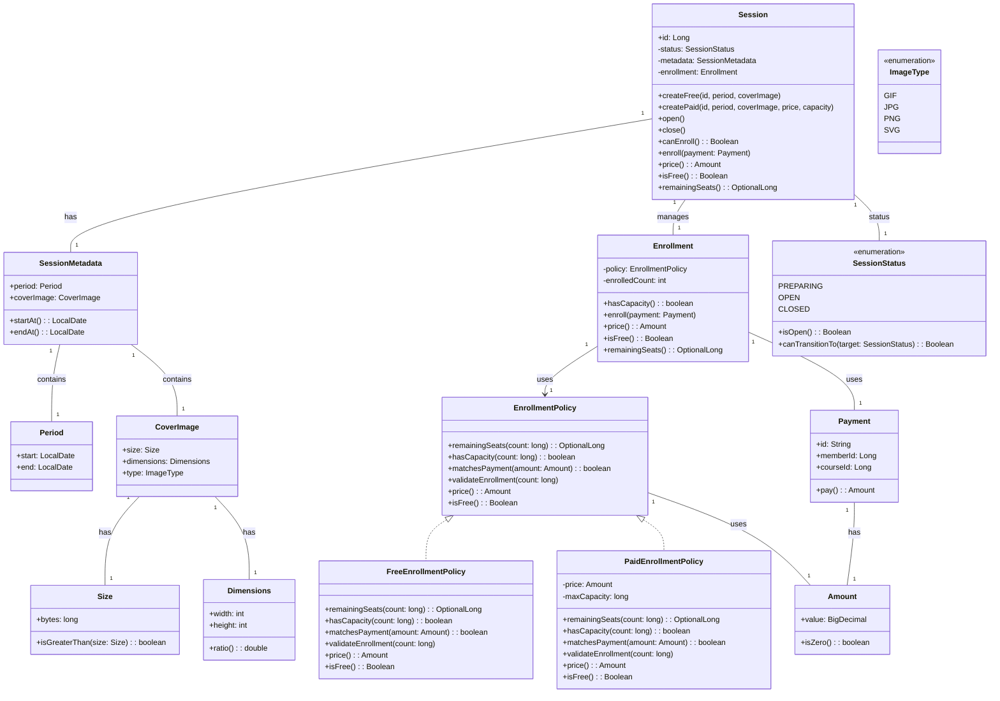

```mermaid
classDiagram

%% ================= Aggregate Root =================
class Session {
  +id: Long
  -status: SessionStatus
  -metadata: SessionMetadata
  -enrollment: Enrollment
  +createFree(id, period, coverImage)
  +createPaid(id, period, coverImage, price, capacity)
  +open()
  +close()
  +canEnroll(): Boolean
  +enroll(payment: Payment)
  +price(): Amount
  +isFree(): Boolean
  +remainingSeats(): OptionalLong
}

%% ================= Metadata =================
class SessionMetadata {
  +period: Period
  +coverImage: CoverImage
  +startAt(): LocalDate
  +endAt(): LocalDate
}

class Period {
  +start: LocalDate
  +end: LocalDate
}

class CoverImage {
  +size: Size
  +dimensions: Dimensions
  +type: ImageType
}

class Size {
  +bytes: long
  +isGreaterThan(size: Size): boolean
}

class Dimensions {
  +width: int
  +height: int
  +ratio(): double
}

class ImageType {
  <<enumeration>>
  GIF
  JPG
  PNG
  SVG
}

%% ================= Enrollment & Policy =================
class Enrollment {
  -policy: EnrollmentPolicy
  -enrolledCount: int
  +hasCapacity(): boolean
  +enroll(payment: Payment)
  +price(): Amount
  +isFree(): Boolean
  +remainingSeats(): OptionalLong
}

class EnrollmentPolicy {
  +remainingSeats(count: long): OptionalLong
  +hasCapacity(count: long): boolean
  +matchesPayment(amount: Amount): boolean
  +validateEnrollment(count: long)
  +price(): Amount
  +isFree(): Boolean
}

class FreeEnrollmentPolicy {
  +remainingSeats(count: long): OptionalLong
  +hasCapacity(count: long): boolean
  +matchesPayment(amount: Amount): boolean
  +validateEnrollment(count: long)
  +price(): Amount
  +isFree(): Boolean
}

class PaidEnrollmentPolicy {
  -price: Amount
  -maxCapacity: long
  +remainingSeats(count: long): OptionalLong
  +hasCapacity(count: long): boolean
  +matchesPayment(amount: Amount): boolean
  +validateEnrollment(count: long)
  +price(): Amount
  +isFree(): Boolean
}

class Amount {
  +value: BigDecimal
  +isZero(): boolean
}

class Payment {
  +id: String
  +memberId: Long
  +courseId: Long
  +pay(): Amount
}

class SessionStatus {
  <<enumeration>>
  PREPARING
  OPEN
  CLOSED
  +isOpen(): Boolean
  +canTransitionTo(target: SessionStatus): Boolean
}

%% ================= Relationships =================
Session "1" -- "1" SessionMetadata : has
Session "1" -- "1" Enrollment : manages
SessionMetadata "1" -- "1" Period : contains
SessionMetadata "1" -- "1" CoverImage : contains
CoverImage "1" -- "1" Size : has
CoverImage "1" -- "1" Dimensions : has
Enrollment "1" --> "1" EnrollmentPolicy : uses
EnrollmentPolicy <|.. FreeEnrollmentPolicy
EnrollmentPolicy <|.. PaidEnrollmentPolicy
Enrollment "1" -- "1" Payment : uses
EnrollmentPolicy "1" -- "1" Amount : uses
Payment "1" -- "1" Amount : has
Session "1" -- "1" SessionStatus : status
```
